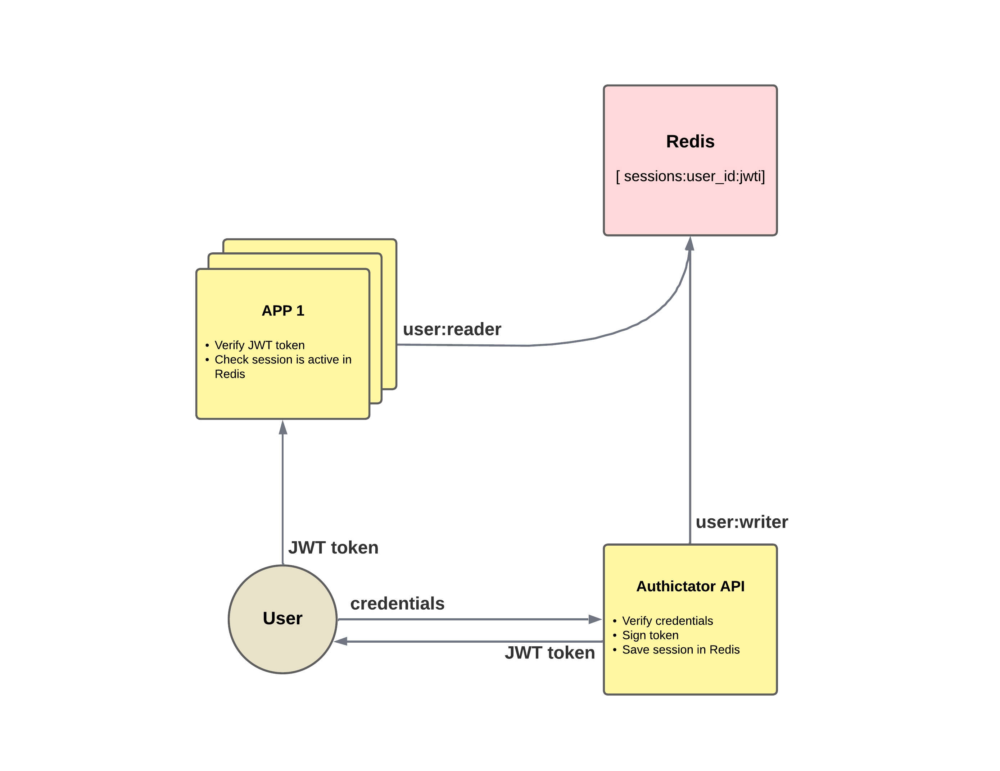

# Authictator

A minimalist, high-performance authentication and user management service built with Fastify, TypeScript, and MongoDB.

## Overview

Authictator is designed to handle user creation, password management, account activation, and authentication in a lightweight yet secure manner.
It provides a simple API for authentication and authorization that can be easily integrated into other services.

Once users are authenticated, Authictator issues tokens that can be used by other components or microservices to securely identify and authorize requests.

This project focuses on speed, simplicity, and security, leveraging Fastify’s performance and TypeScript’s type safety to build a clean, extensible authentication layer.

## Features

- **User Management:** Create, update, and activate user accounts.

- **Secure Password Handling:** Passwords are hashed and never stored in plaintext.

- **Account Activation:** Users must confirm their accounts via activation links.

- **Token-based Authentication:** JSON Web Tokens (JWT) are used for stateless authentication.

- **RBAC:** Implement mechanism to allow Role-Based Access Control.

- **Multi-Factor Authentication (MFA):** Supports optional MFA to enhance account security.

- **Rate Limiting:** Protects against brute-force and abuse attacks with configurable limits.

- **Minimalist API:** Clean and fast endpoints designed for integration into larger systems.

- **Extensible Design:** Easily add new authentication strategies or data sources.

## Sessions Management




### Redis cache

Redis will be use as a temporary cache to store sessions, MFA secrets candidates and locked logins process. The access to this cache is controlled by two type of users `writer` and `reader`. Readers will have access only to the sessions collection to validate the active session linked to the token.

This users are configured by a template and environemnt variables. This templare is used in the redis service of the docker-compose:

````
user default off
user ${REDIS_WRITER_USERNAME} on >${REDIS_WRITER_PASSWORD} ~* +@all
user ${REDIS_READER_USERNAME} on >${REDIS_READER_PASSWORD} ~sessions:* +@read
````

## API Overview
| Endpoint             | Method |Description                                      |
| -------------------- | ------ | ----------------------------------------------- |
| `/`                  | GET    | Health checker                                  |
| `/.well-known/jwks.json`| GET | Get the JWT public key                          |
| `/signup`            | POST   | Create a new user (may require auth)            |
| `/signin`            | POST   | Sign in and get a JWT token                     |
| `/signinmfa`         | POST   | Sign in with a MFA code                         |
| `/verify/{code}`     | POST   | Verify user with a verification code            |
| `/mfa`               | GET    | Request a secret to setup MFA (requires auth)   |
| `/mfa`               | POST   | Confirm MFA configuration with a temporary code (requires auth) |
| `/forgot`            | POST   | Request a reset password link                   |
| `/forgot/{code}`     | POST   | Reset password                                  |
| `/whoami`            | GET    | Retrieve user profile (requires auth)           |
| `/roles`             | GET    | Retrieve available roles (requires auth)        |
| `/roles`             | POST   | Create a new role (requires auth)               |
| `/roles/{id}`        | PUT    | Edit an existing role (requires auth)           |
| `/roles/{id}`        | DELETE | Soft-delete a role (requires auth)              |
| `/permissions`       | GET    | Retrieve available permissions (requires auth)  |
| `/permissions`       | POST   | Create a new permission (requires auth)         |
| `/permissions/{id}`  | PUT    | Edit an existing permission (requires auth)     |
| `/permissions/{id}`  | DELETE | Soft-delete a permission (requires auth)        |
| `/logout?allsessions`| GET    | Revoke token and destroy session (requires auth)|

Protected endpoints require a valid JWT in the Authorization header.

## Roles and Permissions

Authictator implements a Role-Based Access Control (RBAC) mechanism that allows fine-grained authorization of users across endpoints and services.

### How It Works

Permissions define what specific actions can be performed (e.g., user:read, user:update, role:create).

Roles are collections of permissions. Users are assigned one or more roles.

During authentication, the user’s roles are encoded into the JWT payload to facilitate stateless authorization in other services.

#### Default Role

Every user must have at least one role assigned.
When a new user is created (via /signup or through an admin process), Authictator assigns the default role automatically if none is provided.

This default role is defined by the environment variable:
````
DEFAULT_ROLE=
````

It should correspond to a role existing in the database. The initial roles and permissions are automatically seeded via the migrations.

#### Admin Role

An admin role is also created during the migrations process.
This role is intended for system administration and carries all available permissions.

To prevent security leaks:
- The `admin` role cannot be assigned to users through public endpoints.
- The role name is protected and cannot be modified or deleted.
- The admin user, created via migrations, automatically receives this role.

You can configure the admin role and credentials via the following environment variables:
````
ADMIN_ROLE_NAME=
ADMIN_EMAIL=
ADMIN_PASSWORD=
````

## Development

### API Archicture

A pretty simple layers architecture ensures the data validation and consistency at different levels:


### Tech Stack

- **Fastify:** High-performance Node.js web framework.

- **TypeScript:** Strongly typed JavaScript for safer and cleaner code.

- **MongoDB:** Flexible NoSQL database for user and token storage.


### Basic Configuration

Execution access will be require to run the redis script:
```
chmod +x redis/redis-entrypoint.sh
```

Do not forget to set the environment variables in the `.env` file located in the root directory:

```
# Basics
HOST=
PORT=
ADMIN_EMAIL=
ADMIN_PASSWORD=
ADMIN_ROLE_NAME=
DEFAULT_ROLE=
RATE_LIMIT_MAX=

# Database
DATABASE_URL=
DATABASE_NAME=
DATABASE_PORT=
MONGO_INITDB_ROOT_USERNAME=
MONGO_INITDB_ROOT_PASSWORD=
ENCRYPTION_KEY=

# Force MFA to login
FORCE_MFA=

# Allow public signup
FREE_SIGNUP=

# Email sender
SMTP_HOST=
SMTP_PORT=
SMTP_USER=
SMTP_PASS=
SMTP_FROM=

# Redis
REDIS_HOST=
REDIS_PORT=
REDIS_WRITER_USERNAME=
REDIS_WRITER_PASSWORD=
REDIS_READER_USERNAME=
REDIS_READER_PASSWORD=

# JWT keys
JWT_PRIVATE_KEY_PATH=
JWT_PUBLIC_KEY_PATH=
```

Initial data will be required. This data is delivered by MongoDB migrations. To run them use npm command:

````
npm run migrate
````
### Security

- All sensitive data (passwords, MFA secrets) are hashed or encrypted. 
- Tokens include expiration and audience validation.
- Rate limiting prevents excessive login attempts.
- MFA adds an additional layer of identity verification.

#### Signature keys

`RS256` algorithm is used to generate `public` and `private` keys. This keys will be used to sign and verify tokens. The public key will be available publicly for any client to download at `GET /.well-known/jwks.json`. This json can be used to verify the authenticity of the signature in tokens.

A command to generate this keys and endpoint is available with npm:
````
npm run setup:keys
````
