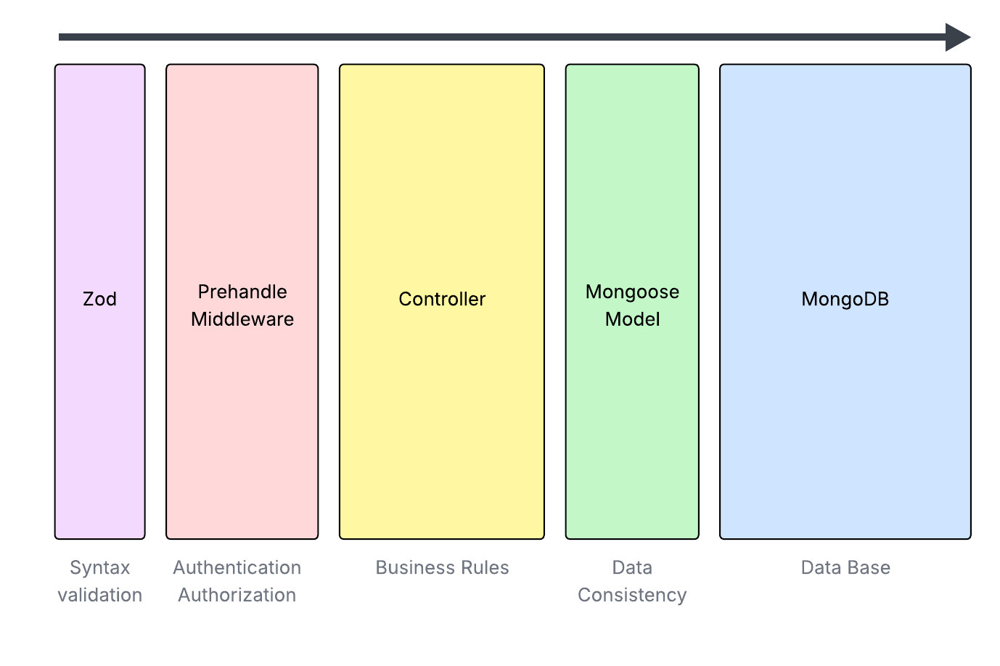

# Authictator

A minimalist, high-performance authentication and user management service built with Fastify, TypeScript, and MongoDB.

## Overview

Authictator is designed to handle user creation, password management, account activation, and authentication in a lightweight yet secure manner.
It provides a simple API for authentication and authorization that can be easily integrated into other services.

Once users are authenticated, Authictator issues tokens that can be used by other components or microservices to securely identify and authorize requests.

This project focuses on speed, simplicity, and security, leveraging Fastify’s performance and TypeScript’s type safety to build a clean, extensible authentication layer.

## Features

- **User Management:** Create, update, and activate user accounts.

- **Secure Password Handling:** Passwords are hashed and never stored in plaintext.

- **Account Activation:** Users must confirm their accounts via activation links.

- **Token-based Authentication:** JSON Web Tokens (JWT) are used for stateless authentication.

- **RBAC:** Implement mechanism to allow Role-Based Access Control.

- **Multi-Factor Authentication (MFA):** Supports optional MFA to enhance account security.

- **Rate Limiting:** Protects against brute-force and abuse attacks with configurable limits.

- **Minimalist API:** Clean and fast endpoints designed for integration into larger systems.

- **Extensible Design:** Easily add new authentication strategies or data sources.

## API Overview
| Endpoint        | Method |Description                                      |
| --------------- | ------ | ----------------------------------------------- |
| `/`             | GET    | Health checker.                                 |
| `/signup`       | POST   | Create a new user                               |
| `/signin`       | POST   | Sign in and get a JWT token                     |
| `/verify/{code}`| POST   | Verify user with a verification code            |
| `/forgot`       | POST   | Request a reset password link                   |
| `/forgot/{code}`| POST   | Reset password                                  |
| `/whoami`       | GET    | Retrieve user profile (requires auth)           |
| `/roles`      | GET    | Retrieve available roles (requires auth)           |
| `/roles`      | POST   | Create a new role (requires auth)           |
| `/roles/{id}` | PUT    | Edit an existing role (requires auth)          |
| `/roles/{id}` | DELETE | Soft-delete a role (requires auth)           |
| `/permissions`      | GET    | Retrieve available permissions (requires auth)           |
| `/permissions`      | POST   | Create a new permission (requires auth)           |
| `/permissions/{id}` | PUT    | Edit an existing permission (requires auth)          |
| `/permissions/{id}` | DELETE | Soft-delete a permission (requires auth)           |

Protected endpoints require a valid JWT in the Authorization header.

### Security

- All sensitive data (passwords, MFA secrets) are hashed or encrypted. 
- Tokens include expiration and audience validation.
- Rate limiting prevents excessive login attempts.
- MFA adds an additional layer of identity verification.


## Development

### API Archicture

A pretty simple layers architecture ensures the data validation and consistency at different levels:



### Tech Stack

- **Fastify:** High-performance Node.js web framework.

- **TypeScript:** Strongly typed JavaScript for safer and cleaner code.

- **MongoDB:** Flexible NoSQL database for user and token storage.


### Basic Configuration
Create a .env file in the root directory with your configuration:

```
HOST=0.0.0.0
PORT=3000
DATABASE_URL=mongodb://localhost:27017/authictator
DATABASE_PORT=27017
MONGO_INITDB_ROOT_USERNAME=root
MONGO_INITDB_ROOT_PASSWORD=password
JWT_REFRESH_SECRET=your_jwt_secret
JWT_ACCESS_SECRET=your_jwt_secret
RATE_LIMIT_MAX=10
ENABLE_MFA=true
ADMIN_EMAIL=admin@email.com
ADMIN_PASSWORD=password
ADMIN_ROLE_NAME=admin
```